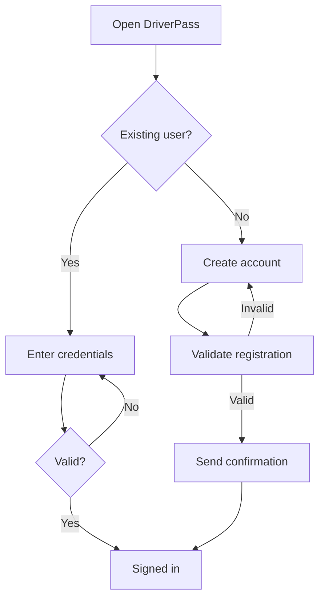
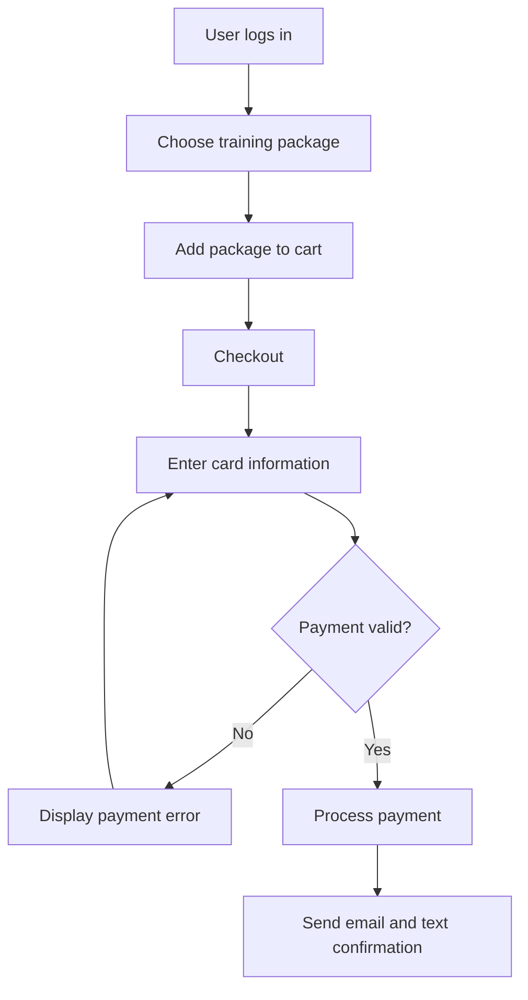
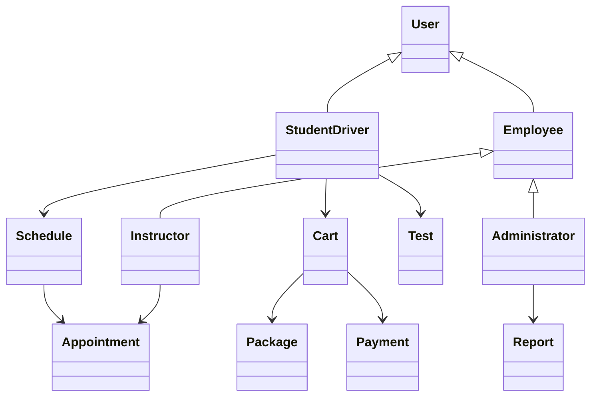
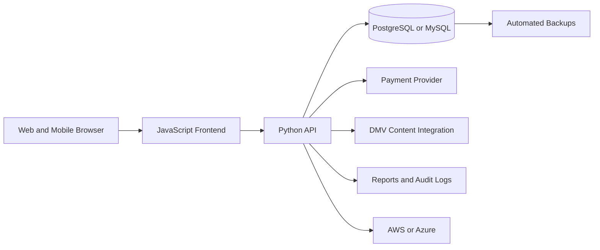

# DriverPass System Analysis & Design

**A complete software design blueprint for a cloud-based driver-training platform**

[Overview](#about-the-project) • [Requirements](#system-requirements) • [UML Design](#uml-design) • [Documents](#project-documents)

---

## About the Project

DriverPass is a proposed web platform designed to help students prepare for driving exams through **DMV-aligned practice tests, lesson scheduling, progress tracking, training packages, instructor feedback, payments, and administrative reporting**.

The project converts stakeholder needs into functional requirements, nonfunctional requirements, workflows, UML models, and a scalable technical architecture.

## Project Snapshot

| Area | Design Decision |
|---|---|
| Users | Students, instructors, administrators, secretaries, and DMV stakeholders |
| Platform | Responsive web application for desktop and mobile browsers |
| Backend | Python preferred, with Java as an alternative |
| Database | PostgreSQL or MySQL relational database |
| Hosting | AWS or Azure cloud infrastructure |
| Security | Role-based access, MFA for administrators, lockout after three failed attempts |
| Reliability | 99% uptime target, automated backups, monitoring, and disaster recovery |
| Performance | Under two seconds for exam submissions and scheduling updates |

## Core Capabilities

- Account creation, login, logout, and password recovery
- Role-based access for students, instructors, and administrators
- DMV-style practice quizzes with automatic grading
- Driving lesson scheduling, modification, and cancellation
- Training package selection, cart, checkout, and payment confirmation
- Student progress tracking and instructor comments
- Administrative user, package, policy, and report management
- Timestamped audit logs for reservation changes

## System Requirements

<strong>Functional requirements</strong>

- Validate credentials and assign role-based permissions
- Allow students to schedule, modify, and cancel lessons
- Grade practice exams and store results
- Track training progress and instructor feedback
- Generate progress and activity reports
- Allow administrators to manage accounts, packages, and DMV updates

<strong>Nonfunctional requirements</strong>

- Compatible with Chrome, Firefox, Safari, and mobile devices
- Less than two seconds response time for key actions
- Cloud-hosted with scalable storage and processing
- Case-insensitive usernames and case-sensitive passwords
- Multi-factor authentication for administrators
- Account lockout after three failed login attempts
- Email or SMS password recovery
- Automated backups and real-time error alerts

<strong>Assumptions and limitations</strong>

**Assumptions**

- DMV policy updates can be integrated through an API
- A third-party provider such as Stripe processes card payments
- Users have reliable internet access

**Limitations**

- No offline scheduling or exam functionality
- Major package customizations require developer involvement

## UML Design

### Use Case Coverage

The system models interactions for students, instructors, administrators, secretaries, and DMV stakeholders across authentication, studying, testing, scheduling, purchasing, reporting, and policy management.

### Login and Registration Flow

### Package Purchase Flow

### Main Domain Model

## Technical Architecture

## Project Timeline

| Phase | Planned Window |
|---|---|
| Requirements collection | Late January to early February |
| Interface design | March |
| Database integration | Late March to early April |
| Login and security | April |
| Testing and delivery | Late April through May |

## Project Documents

| Document | View | Download |
|---|---|---|
| Business Requirements | [Open document](docs/DriverPass-Business-Requirements.md) | [Download](https://raw.githubusercontent.com/rypeguero/System-Analysis-And-Design-DriverPass/main/docs/DriverPass-Business-Requirements.md) |
| System Design and UML | [Open document](docs/DriverPass-System-Design.md) | [Download](https://raw.githubusercontent.com/rypeguero/System-Analysis-And-Design-DriverPass/main/docs/DriverPass-System-Design.md) |

## Skills Demonstrated

`Requirements Analysis` · `UML Modeling` · `Workflow Design` · `Object-Oriented Design` · `Cloud Architecture` · `Database Planning` · `Security Requirements` · `Technical Documentation`

---

**Designed by Ryan A. Peguero**

